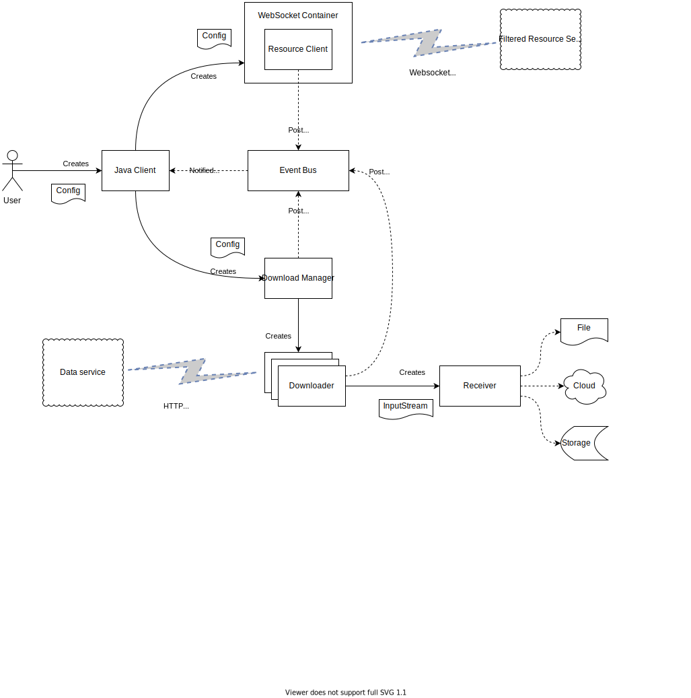

<!---
Copyright 2018-2021 Crown Copyright

Licensed under the Apache License, Version 2.0 (the "License");
you may not use this file except in compliance with the License.
You may obtain a copy of the License at

  http://www.apache.org/licenses/LICENSE-2.0

Unless required by applicable law or agreed to in writing, software
distributed under the License is distributed on an "AS IS" BASIS,
WITHOUT WARRANTIES OR CONDITIONS OF ANY KIND, either express or implied.
See the License for the specific language governing permissions and
limitations under the License.
--->
# Palisade Client (Java)

The palisade client provides access to resources.

Example usage:

```
client = Client.create(Map.of(
    Configuration.KEY_SERVICE_HOST, "host.my",
    Configuration.KEY_SERVICE_PORT, 12091,
    Configuration.KEY_DOWNLOAD_THREADS, 2));

var futureResult = client
    .submit(b -> b
        .userId("user_id")
        .resourceId("resource_id")
        .purpose("purpose")
        .properties(Map.of(
             "key1", "value1",
             "key2", "value2"))
        .receiverClass("my.class.name");
        
var state = result.future().join();

for (IStateDownload dl : state.getDownloads()) {
    System.out.println(dl.getResourceId());
}
```

Once the job is submitted, control is returned to the application without blocking. At this point the result only contains access to a CompletableFuture, which once complete returns the final state of the job.

## Overview

## Logical Diagram



## Events

The Java Client has at its core an EventBus which handles the communication between the major parts of the code. The reasoning behind this is that it keeps the components loosely coupled. This makes the code much easier to maintain and easier to test. The EventBus has the ability to alter how events are posted. Currently, this client uses the `ThreadMode.MAIN_ORDERED` setting. This allows the posted events to be non-blocking.

Following is a breakdown of which classes subscribe and post events:

### Resource Client

The `ResourceClientListener` handles the messages that are received via the websocket. When these messages are received, the listener will post the following events when messages are received from the `FilteredResourceService`. This class does not subscribe to any events via the EventBus, it only posts:

* __ResourceReadyEvent__ - is posted when a message of type `RESOURCE` is received.
* __ResourcesExhaustedEvent__ - is posted when a message of type `COMPLETE` has been received.
* __ErrorEvent__ - is posted when a message of type `Error` has been received.

The `ResourceClient` only handles a single event and that is the `ResourcesExhaustedEvent` which signifies that the Filtered Resource Service does not have thin else to send. This will handle the event by releasing the latch that allows the CompletableFuture returned as part of the result, to complete.

### DownloadManager

The `DownloaderManager` class handles the creation of a runnable to actually control the calling of the `Downloader` instance. The download manager will post the following events during the creation and processing of the runnable:

* __DownloadScheduledEvent__ - posted as soon as `schedule` is called on the download manager and before the executor starts to execute the Runnable.
* __DownloadStartedEvent__ - posted when the process starts within a thread in the pooled executor, but before control is passed to the Downloader. 
* __DownloadCompletedEvent__ - posted as soon as the Downloader returns successfully.
* __DownloadFailedEvent__ - posted when the Downloader exists abnormally.

The download manager does not subscribe to any messages.

### ClientJob

This class is the main class handling all the events during the running of a job. This class also provides the status once it is complete.

The following events are subscribed to:

* __DownloadCompletedEvent__ - updates the state for this job and optionally countdown the shutdown latch if enabled.
* __DownloadFailedEvent__ - updates the state for this job and optionally countdown the shutdown latch if enabled.
* __DownloadStartedEvent__ - updates the state
* __DownloadScheduledEvent__ - updates the state
* __ResourceReadyEvent__ - schedules a new download with the download manager
* __ResourcesExhaustedEvent__ - updates the state as finished
* __ErrorEvent__ - updates the state

A countdown latch is created (with the outstanding number of downloads) once the resource client has closed the websocket. This signifies that no more resources are going to arrive from the Filtered Resource Service. As each download event is received, the latch is decremented. Once it hits 0, the future is completed and the final state is returned.

## Code

The main classes within the client are as follows:

* JavaClient - This is the main entry point and the manager of all events
* DownloadManager - Manages the submission of requests, contains the thread pool
* Downloader - Executes requests to the data service and provides a stream to a Receiver
* FileReceiver - Reads a data stream and writes to a file
* ResourceClient - Manages the flow of message to/from the Filtered resource Service via web sockets
* ResourceClientListener - Receives messages from the websocket, handles them and posts events

## Technologies Used

### Runtime

* [Immutables](https://immutables.github.io/) - Java annotation processors to generate simple, safe and consistent value objects.
* [Jackson]() - JSON for Java. Handles all the (de)serialisation of objects to/from the Palisade servers.
* [EventBus](https://github.com/greenrobot/EventBus) - Publish/subscribe event bus for Android and Java.
* [JSON Flattener](https://github.com/wnameless/json-flattener) - A Java utility is used to FLATTEN nested JSON objects and even more to UNFLATTEN it back.

### Test Only

* [Junit5](https://junit.org/junit5/) - Needs no introduction :)
* [AssertJ](https://assertj.github.io/doc/) - Excellent testing library
* [Logback](http://logback.qos.ch/) - Great logging library. Used for testing.
* [Awaitility](https://github.com/awaitility/awaitility) - Good for asynchronous testing
* [Micronaut HTTP Server](https://micronaut.io/) - Used for testing
